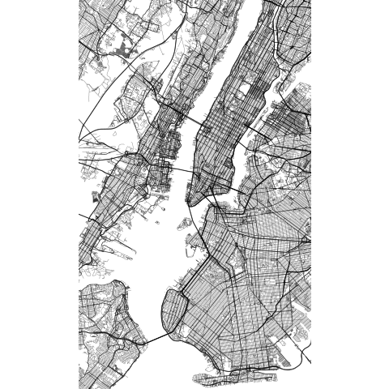

# R graphics

This repository contains a collection of graphics I have been working on
with the aim to learn how to make fancy visualizations using R. Used
data covers a variety of topics.

## Streetmap

The first plot is a streetmap. I bet you have seen such pictures as
elements of decoration and you may even thought of buying one yourself.
Well, I here show you how I made a NYC streetmap for myself following
[this tutorial](https://ggplot2tutor.com/streetmaps/streetmaps/) and
using [OpenStreetMap
database](https://en.wikipedia.org/wiki/OpenStreetMap). Below you can
see the final result. As said, this was NYC but you can just use any
other spot you like in the world. Besides, you can easily customize the
design elements with some notions of ggplot2.

